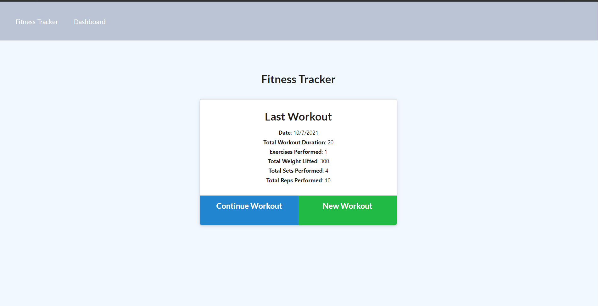
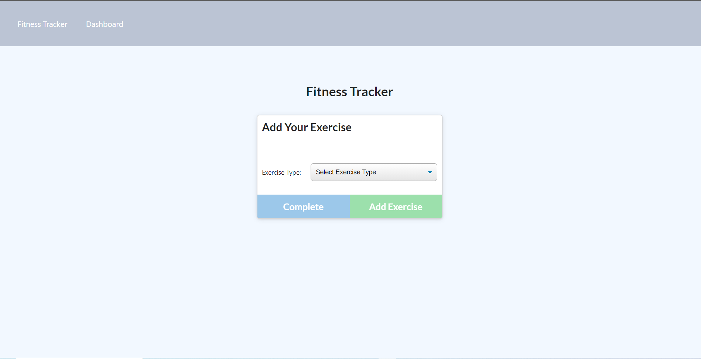
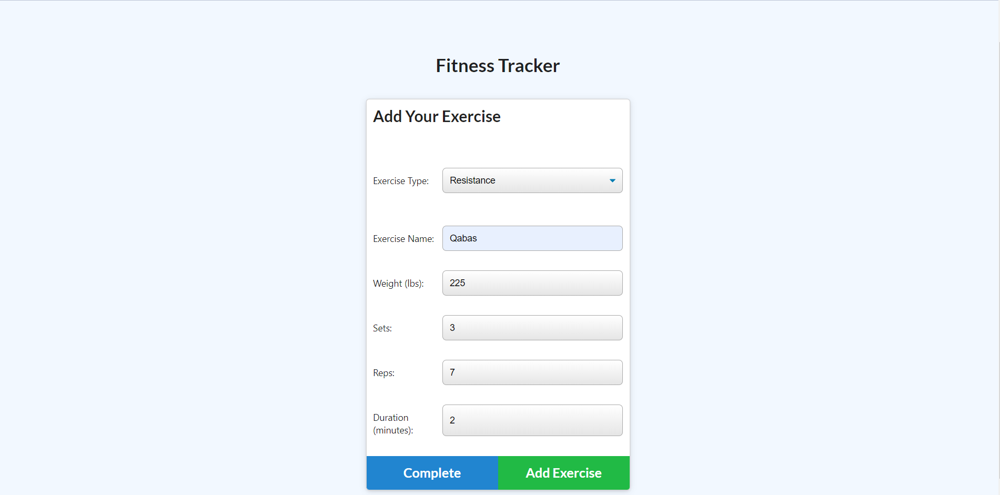
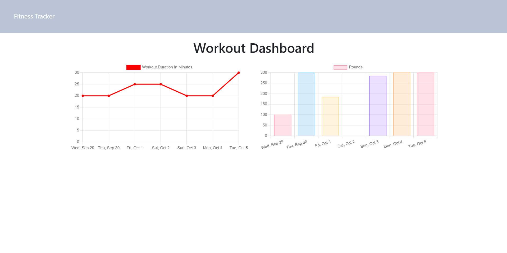

# Fitness Tracker
  ----
  [](https://opensource.org/licenses/MIT)
## Table of Contents
- [Description](#description)
- [Installation](#installation)
- [Technologies](#Technologies)
- [Usage](#usage)
- [Contribution](#contribution)
- [Questions](#questions)

[Click here to view The Tech Blog Live! ]( https://young-waters-38930.herokuapp.com/?id=61606ca853bc1a2ef8d73abe )

## Description:
This app helps users to be able to view create and track daily workouts,to be able to log multiple exercises in a workout on a given day also be able to track the (name, type, weight, sets, reps and duration) if there's a need of a cardio exercise cardio exercise, I should be able to track my distance traveled.


## Technologies
```
- Html.
- Css.
- JavaScript.
- Express.
- Mongoose.
- Logger.
- MongoDB.
```

### Installation
Installation 
```
npm run watch
```


### Usage
A user can create a new workout then add the exercise they are doing. If it is cardio, then they will say what form of cardio, the distance in miles, and the duration in minutes. If the user chooses resistance, then they will input the name, weight in pounds, sets, reps and duration in minutes.


### Contribution
```
Contributions, issues, and feature requests are welcome!
Give a ⭐️ if you like this project!
```

### A Screenshot of my deployed Fitness Tracker

 
 
 
 

[full demo video]()

### Questions? 
For any questions, please contact me with the information below:

doctorqa@yahoo.com

[LinkedIn Profile](https://www.linkedin.com/in/qabas-al-ani-7b858863/)

[Github Profile](https://github.com/Qabas-al-ani)

